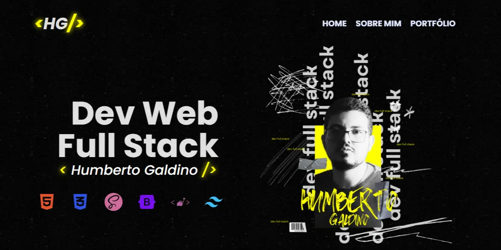

# 💻 **Humberto Galdino - Portfólio Web**



Bem-vindo ao repositório do meu portfólio! Este projeto foi desenvolvido para apresentar minhas habilidades, experiências e projetos como Desenvolvedor Web Full Stack.

---

## 🌟 **Sobre o Portfólio**

Este portfólio é uma aplicação web responsiva e moderna, construída para destacar meu trabalho e oferecer aos visitantes uma experiência visual imersiva. Aqui você encontrará informações sobre mim, minhas competências técnicas e exemplos de projetos desenvolvidos.

---

## 🛠️ **Tecnologias Utilizadas**

As principais tecnologias e ferramentas empregadas no desenvolvimento deste portfólio incluem:

- **HTML5**
- **CSS3**
- **Tailwind CSS**
- **JavaScript**
- **React.js**
- **Next.js**
- **Figma**
- **Git**
- **GitHub**

---

## 📑 **Seções do Portfólio**

1. **Home**  
   - Apresentação com destaque para minha profissão e identidade visual.

2. **Sobre Mim**  
   - Breve descrição da minha formação, experiência e habilidades técnicas, com um toque pessoal e citações inspiradoras.

3. **Portfólio**  
   - Galeria de projetos com detalhes técnicos e links para repositórios.

4. **Rodapé**  
   - Links para redes sociais e informações de contato.

---

## 🚀 **Como Executar Localmente**

Para rodar o projeto na sua máquina, siga os passos abaixo:

1. Clone o repositório:
   ```bash
   git clone https://github.com/seu-usuario/seu-repositorio.git
2. Acesse o diretório do projeto:
    ```bash
    cd seu-repositorio
3. Instale as dependências:
    ```bash
    npm install
4. Inicie o servidor de desenvolvimento:
    ```bash
    npm run dev
5. Acesse em seu navegador:
    ```bash
    http://localhost:3000
## 🎨 **Design**

O design deste portfólio foi cuidadosamente planejado e desenvolvido no Figma, com um estilo minimalista, moderno e focado na clareza da informação.

## 📝 **Licença**
Este projeto está licenciado sob a MIT License. Sinta-se à vontade para usá-lo como inspiração para o seu próprio portfólio.

## 🌐 **Contato**

Portfólio Online: [Site](https://humbertogaldino.github.io/humbertogaldino.dev/)

### 👨‍💻 **Deselvolvido por Humberto**

[](humberto.galdino@live.com)
[](https://www.digitalhouse.com/br)
[](https://www.instagram.com/humberto.galdino/)
[](https://wa.me/5562999742142?text=Ol%C3%A1+Humberto%2C+visualizei+seu+perfil+no+GitHub)

